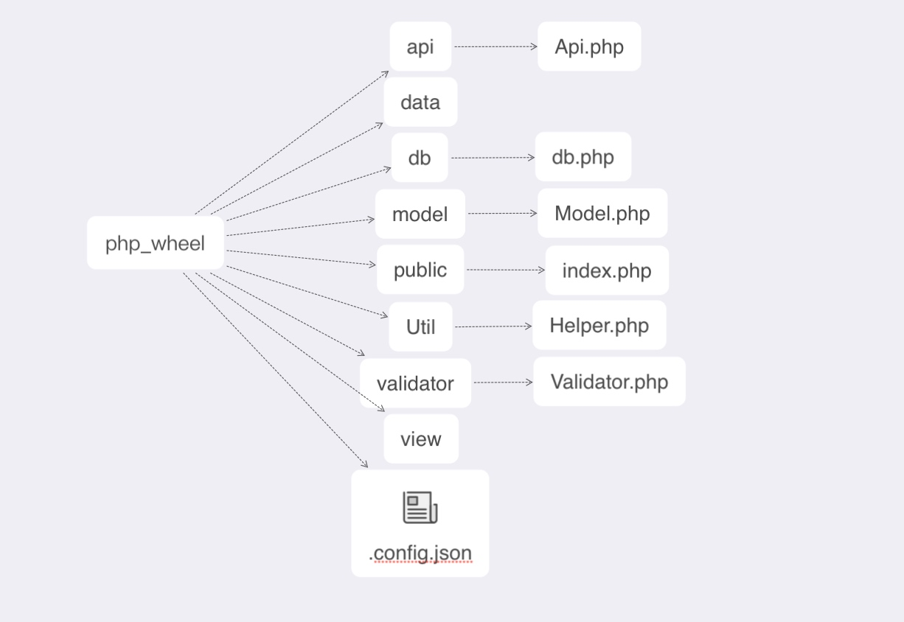
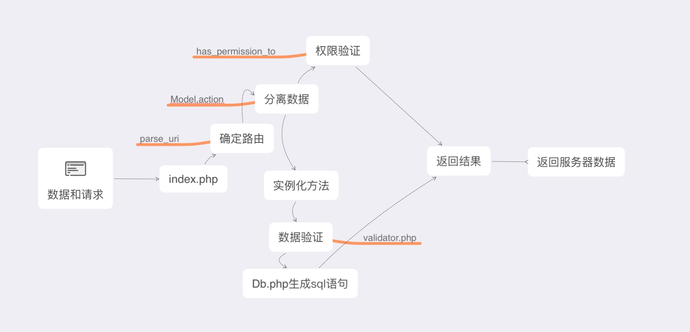

# pdo-demo1


##1. 运行


`git clone https://github.com/yinminqian/php_wheel`

`cd public`

`php -S localhost:2333 -t ./`


浏览器打开`localhost:2333`

-------


##2.目录结构


3.完整的继承链


 
##4.路由规则:

 路由分为为**视图路由**和**api路由**,当输入视图路由的时,路由系统用`switch`语句进行控制,每次有新的指令进入,就会判断当前的设定,如果没有,可以自行设定返回404界面,如果有就会直接返回这个视图界面
        
-------
视图路由的示例:
`case"home":
            import('view/public/home');
            break;`
            
            
            localhost:2333/home
            这是一个简单的页面路由
-------
api路由也由这个`switch`控制,api路由先判断第一个参数是否是/api

-------
api路由的生成:
` case "api":`
            `$klass = $arr[1];`
            `$method = $arr[2];`

            if (!has_permission_to($method, $klass)) {
                json_die("permission_is_not");
            }

            $msg = [];
            $r = (new $klass)->$method($param, $msg);
            //在这里实例化这个类,让这个方法运行
            if ($r === false)
                json_die(e($msg));
            json_die(s($r));
            break;`


```
localhost:2333/api/cat/add
这是一个简单的api路由
```

-------

##5.权限验证

`has_permission_to('model','action')` 

这个函数在实例化之前运行,函数中有一套规则判断当前用户的权限数组中有没有出现他所携带的请求方法,返回布尔值

你需要根据不同的业务逻辑来完善你的权限数组

mysql中用户表必须有一个字段用来记录用户的权限


##6.model模型

 当路由正确,权限正确,将会实例化一个类,借助`helper.php`中的`e()`,`s()`,可以直接返回布尔值,并且携带数据给前端
 
 1:
 
 你需要/api中创建你的业务文件,参考自带的`cat.php`
 
 2:
 
 `fill()`用来验证和传递数据,这归功于`model`模型从中间直接调用了`validator.php`的方法,如果你需要更多的数据验证规则,严格遵守`validator.php`进行添加新的规则
 
 3:
 
 `save()`会调动`Db.php`生成sql语句,拼接完毕进行增删改查.
 
 4:
 
 特别需要注意的是继承顺序:
 
 `你的业务文件->api.php->model.php->Db.php`
 而其中的`model.php`进行了数据验证
 
7:数据库配置
 
 `.config.json`中进行数据库配置
 
 `Db.php`提供了拼接sql碎片和PDO链接方法
 
8.前端

`public`里面提供了`css`和`js`文件夹

`view`存放你的视图文件
  
  
  9.sql操作
  
  支持链式语法
  
  
  查询:
  `$this->where('键','值')->get()`
  
  删除:
  `$this->where('键','值')->delete()`
  
  
  插入和更新:
  `  public function add($p, &$msg)
      {
          $this->safe_fill($p);
          return $this->save($msg);
      }` 

 
 
 


